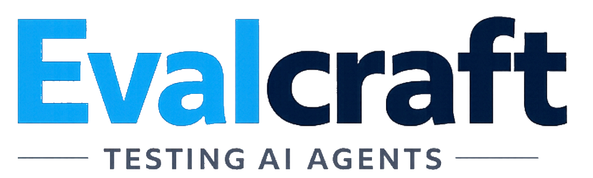

<p align="center">
  
</p>
<p align="center"><strong>The pytest for AI agents.</strong> Capture, replay, mock, and evaluate agent behavior — without burning API credits on every test run.</p>

[](https://github.com/beyhangl/evalcraft/actions/workflows/ci.yml)
[](https://pypi.org/project/evalcraft/)
[](https://pypi.org/project/evalcraft/)
[](LICENSE)

---

## Get Started in 60 Seconds

```bash
pip install evalcraft
evalcraft init                # scaffolds tests/cassettes/ and a sample test
pytest --evalcraft            # run with recording
```

That's it. Your first cassette is recorded, committed to git, and replays for free on every future run. See the [5-minute quickstart](https://beyhangl.github.io/evalcraft/docs/user-guide/quickstart/) for the full walkthrough.

---

## The problem

Agent testing is broken:

- **Expensive.** Running 200 tests against GPT-4 costs real money. Every commit.
- **Non-deterministic.** Tests fail randomly because LLMs aren't functions.
- **No CI/CD story.** You can't gate deploys on eval results if evals take 10 minutes and cost $5.

Evalcraft fixes this by recording agent runs as **cassettes** (like VCR for HTTP), then replaying them deterministically. Your test suite goes from 10 minutes + $5 to 200ms + $0.

---

## How it works

```
  Your Agent
      │
      ▼
┌─────────────┐    record     ┌──────────────┐
│  CaptureCtx │ ────────────► │   Cassette   │  (plain JSON, git-friendly)
│             │               │  (spans[])   │
└─────────────┘               └──────┬───────┘
                                     │
                    ┌────────────────┼────────────────┐
                    ▼                ▼                ▼
              replay()          MockLLM /        assert_*()
           (zero API calls)    MockTool()       (scorers)
                    │                                 │
                    └──────────────┬──────────────────┘
                                   ▼
                            pytest / CI gate
                           (200ms, $0.00)
```

---

## Install

```bash
pip install evalcraft

# With pytest plugin
pip install "evalcraft[pytest]"

# With framework adapters
pip install "evalcraft[openai]"     # OpenAI SDK adapter
pip install "evalcraft[langchain]"  # LangChain/LangGraph adapter

# Everything
pip install "evalcraft[all]"
```

---

## 5-minute quickstart

### 1. Capture an agent run

```python
from evalcraft import CaptureContext

with CaptureContext(
    name="weather_agent_test",
    agent_name="weather_agent",
    save_path="tests/cassettes/weather.json",
) as ctx:
    ctx.record_input("What's the weather in Paris?")

    # Run your agent — wrap tool/LLM calls with record_* methods
    ctx.record_tool_call("get_weather", args={"city": "Paris"}, result={"temp": 18, "condition": "cloudy"})
    ctx.record_llm_call(
        model="gpt-4o",
        input="User asked about weather. Tool returned: cloudy 18°C",
        output="It's 18°C and cloudy in Paris right now.",
        prompt_tokens=120,
        completion_tokens=15,
        cost_usd=0.0008,
    )

    ctx.record_output("It's 18°C and cloudy in Paris right now.")

cassette = ctx.cassette
print(f"Captured {cassette.tool_call_count} tool calls, ${cassette.total_cost_usd:.4f}")
# Captured 1 tool calls, $0.0008
```

### 2. Replay without API calls

```python
from evalcraft import replay

# Loads the cassette and replays all spans — zero LLM calls
run = replay("tests/cassettes/weather.json")

assert run.replayed is True
assert run.cassette.output_text == "It's 18°C and cloudy in Paris right now."
```

### 3. Assert tool behavior

```python
from evalcraft import replay, assert_tool_called, assert_tool_order, assert_cost_under

run = replay("tests/cassettes/weather.json")

assert assert_tool_called(run, "get_weather").passed
assert assert_tool_called(run, "get_weather", with_args={"city": "Paris"}).passed
assert assert_cost_under(run, max_usd=0.05).passed
```

### 4. Mock LLM responses

```python
from evalcraft import MockLLM, MockTool, CaptureContext

llm = MockLLM()
llm.add_response("*", "It's sunny and 22°C.")  # wildcard match

search = MockTool("web_search")
search.returns({"results": [{"title": "Weather Paris", "snippet": "Sunny, 22°C"}]})

with CaptureContext(name="mocked_run", save_path="tests/cassettes/mocked.json") as ctx:
    ctx.record_input("Weather in Paris?")

    search_result = search.call(query="Paris weather today")
    response = llm.complete(f"Search result: {search_result}")

    ctx.record_output(response.content)

search.assert_called(times=1)
search.assert_called_with(query="Paris weather today")
llm.assert_called(times=1)
```

### 5. Use with pytest

```python
# tests/test_weather_agent.py
from evalcraft import replay, assert_tool_called, assert_tool_order, assert_cost_under

def test_agent_calls_weather_tool():
    run = replay("tests/cassettes/weather.json")
    result = assert_tool_called(run, "get_weather")
    assert result.passed, result.message

def test_agent_tool_sequence():
    run = replay("tests/cassettes/weather.json")
    result = assert_tool_order(run, ["get_weather"])
    assert result.passed, result.message

def test_agent_cost_budget():
    run = replay("tests/cassettes/weather.json")
    result = assert_cost_under(run, max_usd=0.01)
    assert result.passed, result.message

def test_agent_output():
    run = replay("tests/cassettes/weather.json")
    assert "Paris" in run.cassette.output_text or "cloudy" in run.cassette.output_text
```

```bash
pytest tests/ -v
# 200ms, $0.00
```

---

## Examples

Four complete, self-contained example projects — each with pre-recorded cassettes,
working test suites, and step-by-step READMEs.

| Example | Scenario | What it demonstrates |
|---------|----------|---------------------|
| [openai-agent/](examples/openai-agent/) | Customer support agent (ShopEasy) | `OpenAIAdapter`, tool call assertions, golden sets, `MockLLM` + `MockTool` unit tests |
| [anthropic-agent/](examples/anthropic-agent/) | Code review bot (PRs via Claude) | `AnthropicAdapter`, multi-turn testing, security assertions, `add_sequential_responses` |
| [langgraph-workflow/](examples/langgraph-workflow/) | RAG policy Q&A pipeline | `LangGraphAdapter`, node-order assertions, `SpanKind.AGENT_STEP` inspection, citation validation |
| [ci-pipeline/](examples/ci-pipeline/) | GitHub Actions CI gate | GitHub Actions workflow, standalone gate script, cassette refresh strategy |

### Run any example in 60 seconds (no API key needed)

```bash
cd examples/openai-agent
pip install -r requirements.txt
pytest tests/ -v
# 15 tests pass in ~0.3s, $0.00
```

All cassettes are pre-recorded and committed to the repo. Tests replay
them deterministically — no API key, no network calls, no cost.

---

## Why Evalcraft?

| | Evalcraft | Braintrust | LangSmith | Promptfoo |
|---|---|---|---|---|
| Cassette-based replay | ✅ | ❌ | ❌ | ❌ |
| Zero-cost CI testing | ✅ | ❌ | ❌ | Partial |
| pytest-native | ✅ | ❌ | ❌ | ❌ |
| Mock LLM / Tools | ✅ | ❌ | ❌ | ❌ |
| Framework agnostic | ✅ | ✅ | ✅ | ✅ |
| Self-hostable | ✅ | ❌ | Partial | ✅ |
| Observability dashboard | ❌ | ✅ | ✅ | ❌ |
| Pricing | Free / OSS | Paid SaaS | Paid SaaS | Free / OSS |

> Evalcraft is a **testing** tool, not an observability platform. Use Braintrust or LangSmith for production tracing; use Evalcraft to keep your test suite fast and free.

---

## Features

| Feature | Description |
|---------|-------------|
| **Capture** | Record every LLM call, tool use, and agent decision as a cassette |
| **Replay** | Re-run cassettes deterministically — no API calls, zero cost |
| **Mock LLM** | Substitute real LLMs with deterministic mocks (exact / pattern / wildcard) |
| **Mock Tools** | Mock any tool with static, dynamic, sequential, or error-simulating responses |
| **Scorers** | Built-in assertions for tool calls, output content, cost, latency, tokens |
| **Diff** | Compare two cassette runs to detect regressions |
| **CLI** | `evalcraft replay`, `evalcraft diff`, `evalcraft inspect` from your terminal |
| **pytest plugin** | Native fixtures and markers — `cassette`, `mock_llm`, `@pytest.mark.evalcraft` |

---

## Supported frameworks

| Framework | Integration |
|-----------|-------------|
| **OpenAI SDK** | `evalcraft.adapters.openai` — auto-records all `chat.completions.create` calls |
| **LangGraph** | `evalcraft.adapters.langgraph` — callback handler for graphs and chains |
| **Any agent** | Manual `record_tool_call` / `record_llm_call` works with any framework |

### OpenAI

```python
from evalcraft.adapters.openai import patch_openai
from evalcraft import CaptureContext
import openai

patch_openai(openai)  # all subsequent calls are auto-recorded

with CaptureContext(name="openai_run", save_path="tests/cassettes/openai_run.json") as ctx:
    ctx.record_input("Summarize the French Revolution")

    client = openai.OpenAI()
    response = client.chat.completions.create(
        model="gpt-4o-mini",
        messages=[{"role": "user", "content": "Summarize the French Revolution"}],
    )

    ctx.record_output(response.choices[0].message.content)
```

### LangGraph

```python
from evalcraft.adapters.langgraph import EvalcraftCallbackHandler
from evalcraft import CaptureContext

handler = EvalcraftCallbackHandler()

with CaptureContext(name="langgraph_run", save_path="tests/cassettes/lg_run.json") as ctx:
    ctx.record_input("Plan a trip to Tokyo")

    graph = build_travel_agent()
    result = graph.invoke(
        {"messages": [{"role": "user", "content": "Plan a trip to Tokyo"}]},
        config={"callbacks": [handler]},
    )

    ctx.record_output(result["messages"][-1].content)
```

---

## CLI reference

```
evalcraft [command] [options]
```

### `evalcraft replay`

```bash
evalcraft replay tests/cassettes/weather.json
evalcraft replay tests/cassettes/weather.json --override get_weather='{"temp": 5, "condition": "snow"}'
```

### `evalcraft diff`

```bash
evalcraft diff tests/cassettes/weather_v1.json tests/cassettes/weather_v2.json
# Tool sequence: ['get_weather'] → ['get_weather', 'send_alert']
# Output text changed
# Tokens: 135 → 210
```

### `evalcraft inspect`

```bash
evalcraft inspect tests/cassettes/weather.json
evalcraft inspect tests/cassettes/weather.json --kind tool_call
```

### `evalcraft run`

```bash
evalcraft run tests/cassettes/
# ✓ weather.json   (3 spans, $0.0008, 450ms)
# ✓ search.json    (7 spans, $0.0021, 1200ms)
# 2/2 passed
```

---

## Data model

```
Cassette
├── id, name, agent_name, framework
├── input_text, output_text
├── total_tokens, total_cost_usd, total_duration_ms
├── llm_call_count, tool_call_count
├── fingerprint  (SHA-256 of span content — detects regressions)
└── spans[]
    ├── Span (llm_request / llm_response)
    │   ├── model, token_usage, cost_usd
    │   └── input, output
    └── Span (tool_call)
        ├── tool_name, tool_args, tool_result
        └── duration_ms, error
```

Cassettes are plain JSON — check them into git, diff them in PRs.

---

## Contributing

```bash
git clone https://github.com/beyhangl/evalcraft
cd evalcraft
pip install -e ".[dev]"
pytest
```

- Format: `ruff format .`
- Lint: `ruff check .`
- Type check: `mypy evalcraft/`

PRs welcome. Please open an issue first for significant changes. See [CONTRIBUTING.md](CONTRIBUTING.md) for details.

---

## Design Partners

We're working with 10 early teams to shape evalcraft. Design partners get:

- **Hands-on setup help** — we'll pair with you to get evalcraft into your CI pipeline
- **Direct Slack access** — talk to the maintainers, not a support queue
- **Influence the roadmap** — your use cases drive what we build next

Interested? [Sign up here](https://beyhangl.github.io/evalcraft/#frameworks) or email us directly.

---

## License

MIT © 2026 Beyhan Gül. See [LICENSE](LICENSE).
